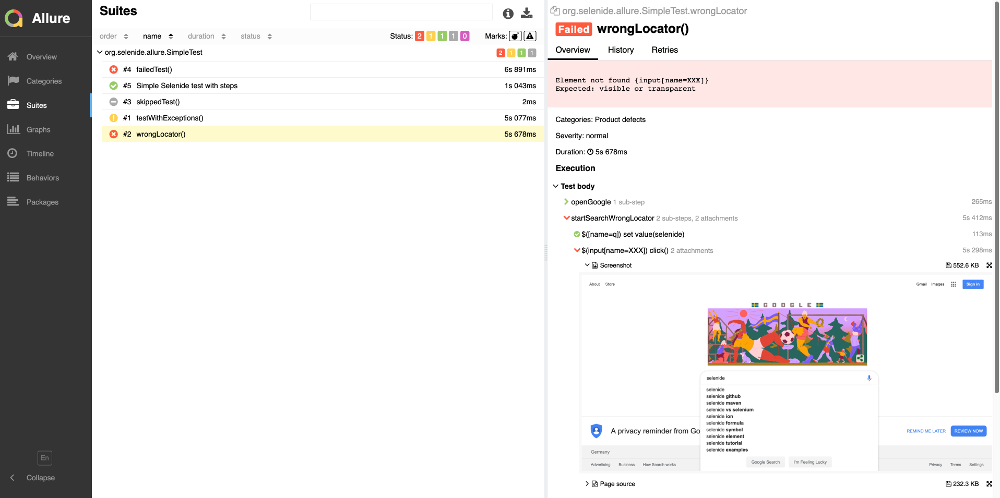

# allure-selenide-example
Example of Allure integration with Selenide (JUnit5,Maven)

Usage:
```
mvn test  
mvn allure:serve 

```

Note that this calls don't generate the history reports, if run multiple times.

Jenkins or TeamCity Allure Plugins handle the history automatically. If you need history without them, see TODO.


